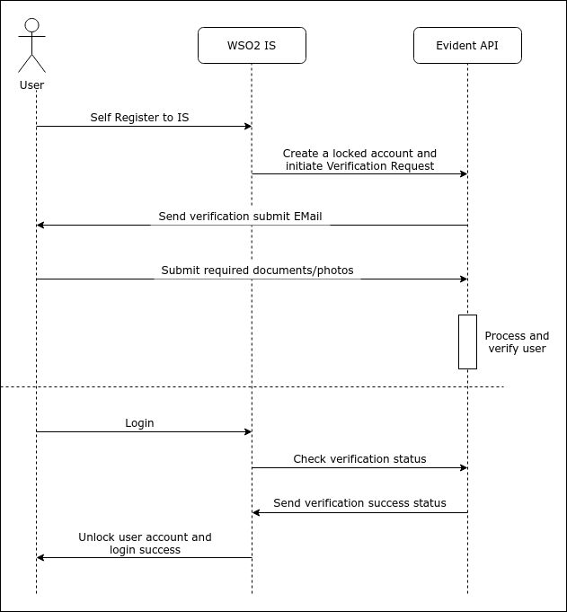
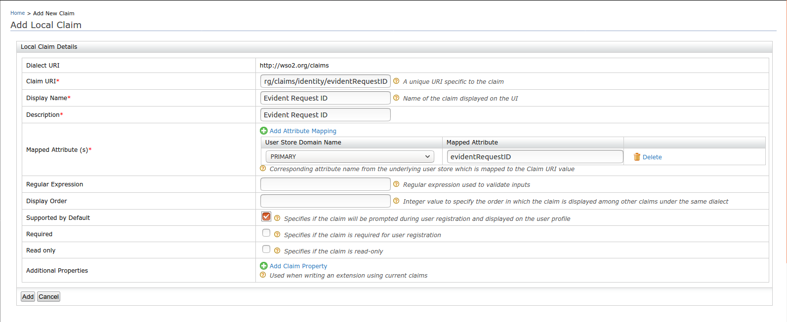
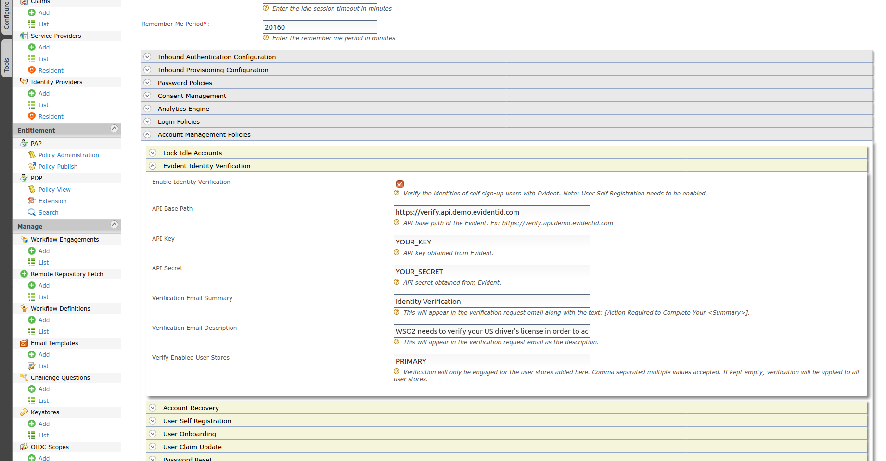
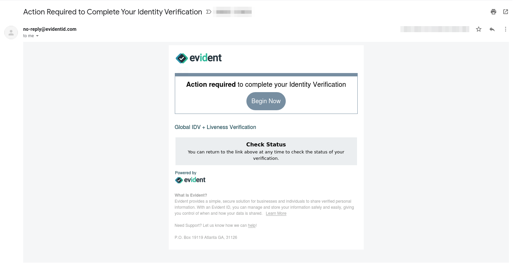

# IDV with Evident - Configuration Guidelines

## Design
This version of the connector is designed to be engaged in the user self-registration flow of the WSO2 Identity 
Server. When a user is registered to IS, we lock the user account and send a verification request to Evident. Then 
Evident will send an email to the user with instructions on how to submit the required documents/photos to complete 
the verification. Once the user submits data, Evident will process and verify the identity of the user.



Whenever the user is trying to login to his/her newly created account, WSO2 IS checks with Evident whether the 
identity verification has been completed or not, if the user account in the locked state. If the verification is 
finished, IS will unlock the user account and let the user login.

## Prerequisites
1. You need to have Evident API credentials for this connector to work. Please 
[contact](https://www.evidentid.com/contact-sales/) the Evident team and they will be happy to help.
2. This version of the connector is tested with WSO2 Identity Server version 5.10.0. Make sure to download and set up 
the correct version of the [Identity Server](https://wso2.com/identity-and-access-management) on your environment.

## Installing the Connector
1. Download the connector from [WSO2 Connector Store](https://store.wso2.com/store/assets/isconnector/list).
2. Copy the ```org.wso2.carbon.identity.verification.evident.connector-x.x.x.jar``` file to 
```<IS-HOME>/repository/components/dropins``` folder.
3. Add the following configurations to the ```<IS-HOME>/repository/conf/deployment.toml``` file.
    ```$xslt
    [[event_handler]]
    name = "evidentEventHandler"
    subscriptions =["POST_ADD_USER", "PRE_AUTHENTICATION"]
    ```
4. (Optional Step) For additional debugging purposes, you can enable debug logs for the connector. Add the following 
configurations to the ```<IS-HOME>/repository/conf/log4j2.properties``` file.
    ```$xslt
    logger.EVIDENT.name = org.wso2.carbon.identity.verification.evident
    logger.EVIDENT.level = DEBUG
    ```
   Also, make sure to add **EVIDENT** to the **loggers** variable.
   ```$xslt
    loggers = EVIDENT, AUDIT_LOG, trace-messages...
   ```
4. Restart the server.

## Configuration Steps
1. Log in to the Identity Server management console using your admin credentials. (Default credential: 
```admin:admin```)
2. Click **Add** under **Claims** section and click on **Add Local Claim** option.
3. Provide the following details and click on **Add** to create a new local claim.
    - Claim URI: http://wso2.org/claims/identity/evidentRequestID
    - Display Name: Evident Request ID 
    - Description: Evident Request ID 
    - Mapped Attribute (s)
        - PRIMARY - evidentRequestID
    - Check _Supported by Default_ option.
    
4. Click on **Resident** under **Identity Providers** section.
5. Expand the **Account Management Policies** and a new section named **Evident Identity Verification** should be
 present.
6. Expand the section and provide below configurations.
    - Enable Identity Verification: Check the checkbox to enable the connector.
    - API Base Path: Specify the Evident API base path. Check 
    [Evident API documentation](https://www.evidentid.com/api-documentation-developers/) for more info.
    - API Key: Add the API key (username) obtained from Evident.
    - API Secret: Add the API secret obtained from Evident.
    - Verification Email Summary: This is the summary of the email that will be sent to the user by Evident. The value 
    will be appended to the default text. Ex: **Action Required to Complete Your [Summary]**.
    - Verification Email Description: This will appear in the verification email as the description.
    - Verify Enabled User Stores: If you have multiple user stores, you can specify to which user stores that you'd 
    need to enable the verification. Comma separated multiple values are accepted an if kept empty, verification will 
    be applied to all the user stores.
    
7. Since the identity verification is engaged in user self-registration, we need to enable that too. Expand the 
**User Self Registration** section and check **Enable Self User Registration** checkbox. Make sure that the 
**Internal Notification Management** is not checked since Evident is handling the notification sending.
8. Click on **Update** to save the configurations.

## Testing
1. Visit the [WSO2 Identity Server User-Portal](https://localhost:9443/user-portal/) and in the Sign In page, 
click on **Create Account** to register a new user.
2. Complete the form and click on the register button. Make sure to enter a valid email address that you have access to.
3. Try to login to the newly created user account. The server should say that the account is not verified yet.
3. Check the inbox for a verification request email from Evident, that'd look like below.
    
4. Complete the verification by clicking on the **Begin Now** button in the email and following the instructions 
provided. 
    - This version of the connector checks the validity of the US Driver's License of the user, and the First Name and
     Last Name extracted from the Driver's License should match with the provided first name and last name when 
     self registering. 
    - Please note that you'll need to have a valid US Driver's License for successful verification. You can 
    manually complete the verification for testing purposes, through Evident API, using the **userIdentityToken** 
    returned. This is printed in WSO2 Identity Server logs if debug logs are enabled for the connector.
    
## Limitations
1. This version of the connector doesn't have an option to customise the verification attributes of the request. By
 default, it sends verification requests for ```core.fullname``` and 
 ```identity_assurance.document_verification.americas.us.drivers_license``` attributes. Please visit 
[Evident documentation](https://www.evidentid.com/api-documentation-developers) for more information on these 
attributes.
